# Self-Driving Car Engineering

  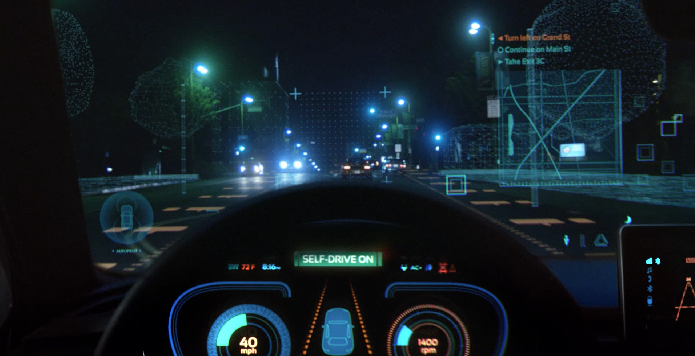

## Overview

This repo contains my entire work and source code committed for Udacity's Self-Driving Car Nano-Degree. 

## Projects

<table style="width:100%">
  <tr>
    <th>
      
<ul class="flexMe" style="width:200">
           
            P1: Basic Lane Finding 
           <!-- 
           <a href="./project_1_lane_finding_basic" name="p1_code">(code)</a> 
           -->
      </ul>

    </th>
        <th>
<ul class="flexMe" style="width:200">
           <a href="./CarND-P02-Traffic-Sign-Classifier">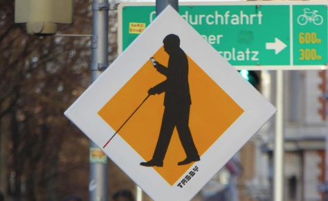</a>
            P2: Traffic Signs Classifier 
           <!-- 
            <a href="./project_2_traffic_sign_classifier" name="p2_code">(code)</a>
           -->
        </ul>

    </th>
       <th>
<ul class="flexMe" style="width:200">
           <a href="./CarND-P03-Behavioral-Cloning">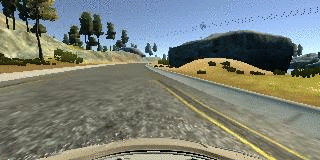</a>
            P3: Behavioral Cloning 
           <!-- 
            <a href="./project_3_behavioral_cloning" name="p3_code">(code)</a>
           -->
        </ul>

    </th>
    
  </tr>
  <tr>
      </th>
        <th>

        <ul class="flexMe" style="width:200">
           <a href="./CarND-P04-Advanced-Lane-Finding">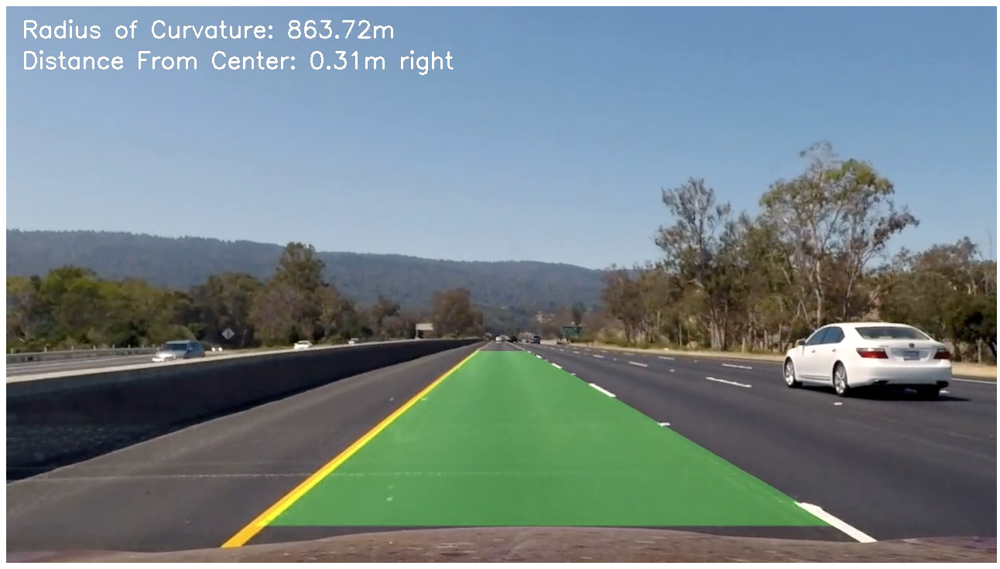</a>
            P4: Adv. Lane Finding 
           <!--
            <a href="./project_4_advanced_lane_finding" name="p4_code">(code)</a>
           -->
        </ul>

    <th>
    

    <ul class="flexMe" style="width:200">
           <a href="./CarND-P05-Vehicle-Detection">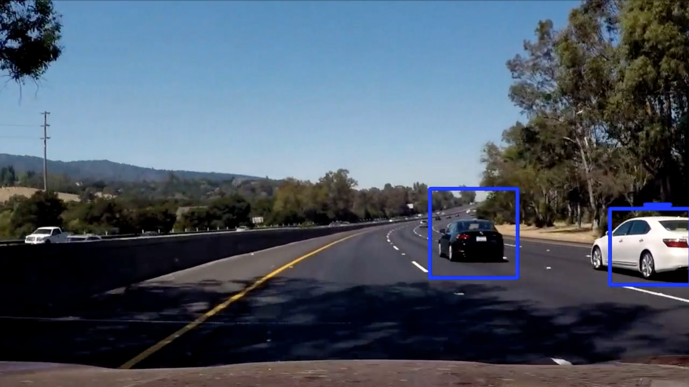</a>
            P5: Vehicle Detection 
           <!--
            <a href="./project_5_vehicle_detection" name="p5_code">(code)</a>
           -->
        </ul>

    </th>
        <th>
<ul class="flexMe" style="width:200">
           
            P6: Extended Kalman Filter 
        </ul>

    </th>

  </tr>
  <tr>
      <th>
<ul class="flexMe" style="width:200">
           <a href="./CarND-P07-Unscented-Kalman-Filter">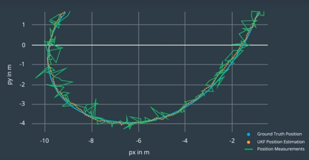</a>
            P7: Unscented Kalman Filter 
        </ul>

    </th>
    <th>
<ul class="flexMe" style="width:200">
           <a href="./CarND-P08-Kidnapped-Vehicle">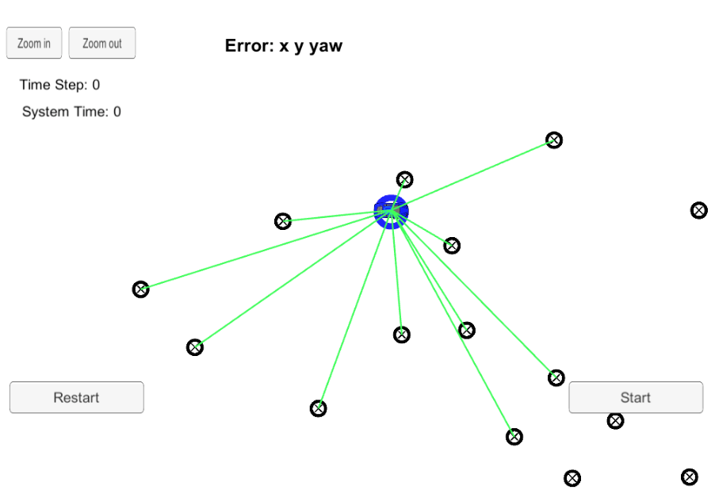</a>
            P8: Kidnapped Vehicle 
        </ul>

    </th>
    <th>
<ul class="flexMe" style="width:200">
           
            P9: PID Controller 
        </ul>

    </th>
  </tr>
  <tr>
    <th>
<ul class="flexMe" style="width:200">
           <a href="./CarND-P10-MPC-Control">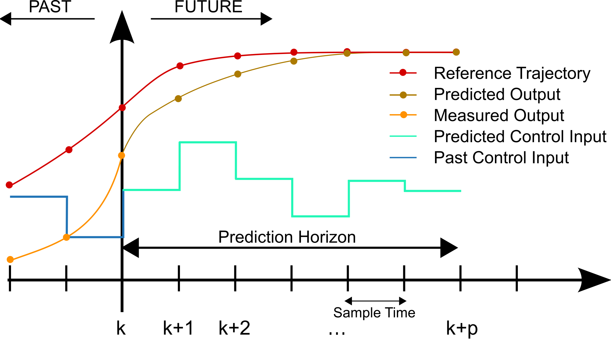</a>
            P10: MPC Controller 
        </ul>

    </th>
   <th>
<ul class="flexMe" style="width:200">
           <a href="./CarND-P11-Path-Planning">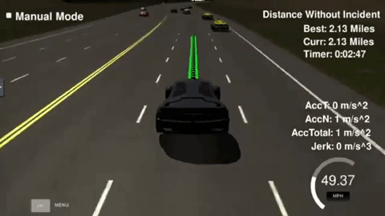</a>
            P11: Path Planning 
        </ul>

    </th>
    <th>
<ul class="flexMe" style="width:200">
          <a href="./CarND-P12-Semantic-Segmentation">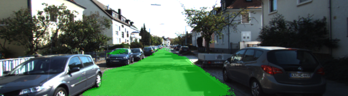</a>
            P12: Semantic Segmentation 
        </ul>

    </th>
  </tr>
</table>

## Capstone Project

<table align="center" style="width:100%">
  <tr>
    <th>
      
<ul style="width:200">
           
            Systems Integration 
      </ul>

    </th>
        <th>
<ul style="width:200">
           <a href="https://github.com/ilopezfr/CarND-Capstone/tree/master/Traffic_Light_Detection">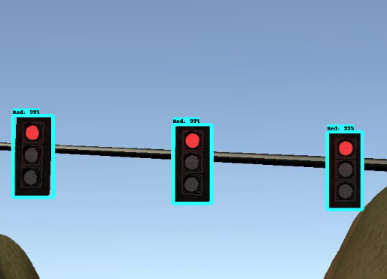</a>
            Traffic Light Detection 
        </ul>

    </th>
  </tr>
</table>

--- 
## Term 1
Focuses on applying machine learning to automotive tasks: deep learning, convolutional neural networks, support vector machines, and computer vision.

#### [P1 - Detecting Lane Lines](CarND-P01-Detecting-Lane-Lines)
- Implementation of a simple lane detector using OpenCV.  

#### [P2 - Traffic Sign Classification](CarND-P02-Traffic-Sign-Classifier)
- Train a classifier of the German Traffic Sign Dataset using CNNs. 
 
#### [P3 - Behavioral Cloning](CarND-P03-Behavioral-Cloning)
- Using CNNs with Keras to clone driving behavior of a vehicle driving in the simulator.

## Term 2
Focuses on building the core robotic functions of an autonomous vehicle system: sensor fusion, localization, and control. This module was built in partnership with [**Mercedes Benz**](http://mbrdna.com/) and [**Uber ATG**](https://www.uber.com/info/atg/).

#### [P4 - Advanced Lane Finding](CarND-P04-Advanced-Lane-Finding)
- Detect lane boundaries and determine numerical estimation of lane curvature and vehicle position. Display this in a video output.
 
#### [P5 - Vehicle Detection](CarND-P05-Vehicle-Detection)
- Apply different image processing techinques and implement a sliding-window technique to search for vehicles in images, then detect and estimate the bounding boxes of vehicles in a video input. 
 
 #### [P6 - Extended Kalman Filter](CarND-P06-Extended-Kalman-Filter)
- Kalman filters are the key mathematical tool for fusing together data. Implement ane Extended Kalman Filter to combine measurements from multiple sensors (LiDAR and Radar) into a non-linear model and estimate the state of a moving object.

 #### [P7 - Unscented Kalman Filter](CarND-P07-Unscented-Kalman-Filter)
- The Unscented Kalman filter is a mathematically-sophisticated approach for combining sensor data. The UKF performs better than the EKF in many situations. Implement an Unscented Kalman Filter to estimate the state of a moving object of interest with noisy lidar and radar measurements. 

#### [P8 - Kidnapped Vehicle](CarND-P08-Kidnapped-Vehicle)
- Use a probabilistic sampling technique known as a **particle filter** in C++ that takes real-world datat to localize a lost vehicle.

 
#### [P9 - PID Control](CarND-P10-MPC-Control)
- Implement the classic closed-loop controller — a proportional-integral-derivative (PID) control system-- in C++ to be able to drive a car around a track in Unity's simulator. 
 
#### [P10 - MPC Control](CarND-P10-MPC-Control)
- Implementation of a Model Predictive Controller in C++.

## Term 3

#### [P11 - Path Planning](CarND-P11-Path-Planning)
- Path planning is the brains of a self-driving car. It’s how a vehicle decides how to get where it’s going, both at the macro and micro levels. It has 3 core components: 
  - **environmental predictions**: predict what other vehicles around will do next based on their past behavior. 
  - **behavioral planning**: at each time step, the path planner must choose a maneuver to perform. It requires building finite-state machines (FSM) to represent all of the different possible maneuvers your vehicle could choose, and then having a Cost function that assigns cost to each maneuver.
  - **trajectory generation**: build candidate trajectories for the vehicle to follow, using C++ and Eigen Linear algebra library 

- The project consists in building an end-to-end path planner to safely navigate around a virtual highway with other cars.

#### [P12 - Road Semantic Segmentation](CarND-P12-Semantic-Segmentation)
- Semantic segmentation identifies free space on the road at pixel-level granularity, which improves decision-making ability. This project consists in building a Fully Convolutional Network (FCN) to perform Semantic Segmentation of road image data.
 
#### [Capstone Project - Systems Integration](https://github.com/ilopezfr/CarND-Capstone)
- Design and implementation of the perception, planning, and control subsystems to enable a physical car ("Carla", Udacity's self-driving car) to drive around a test track using waypoint navigation, while avoiding obstacles and stopping at traffic lights. It requires to integrate ROS nodes and Autoware modules with Carla’s software development environment.

- Tags: Perception, Control, Planning, ROS
#### [Capstone Project - Traffic Light Detection](https://github.com/ilopezfr/CarND-Capstone/tree/master/Traffic_Light_Detection)
- Implementation of the traffic light detector and classifier that is integrated in the self-driving car. It includes the Tensorflow model trained with 3 different datasets using Object Detection API. 