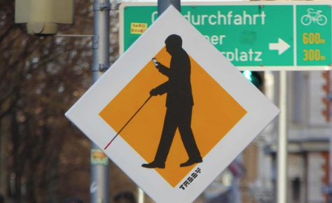
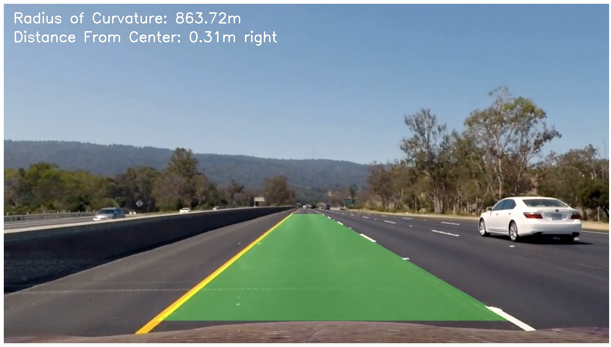
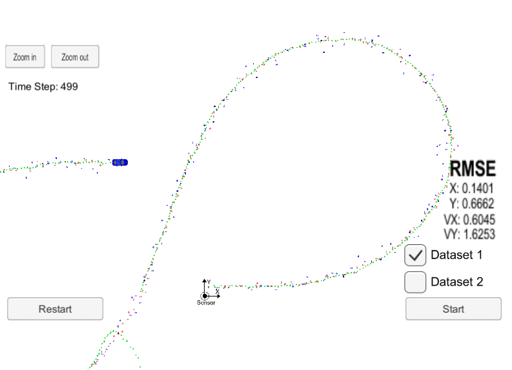
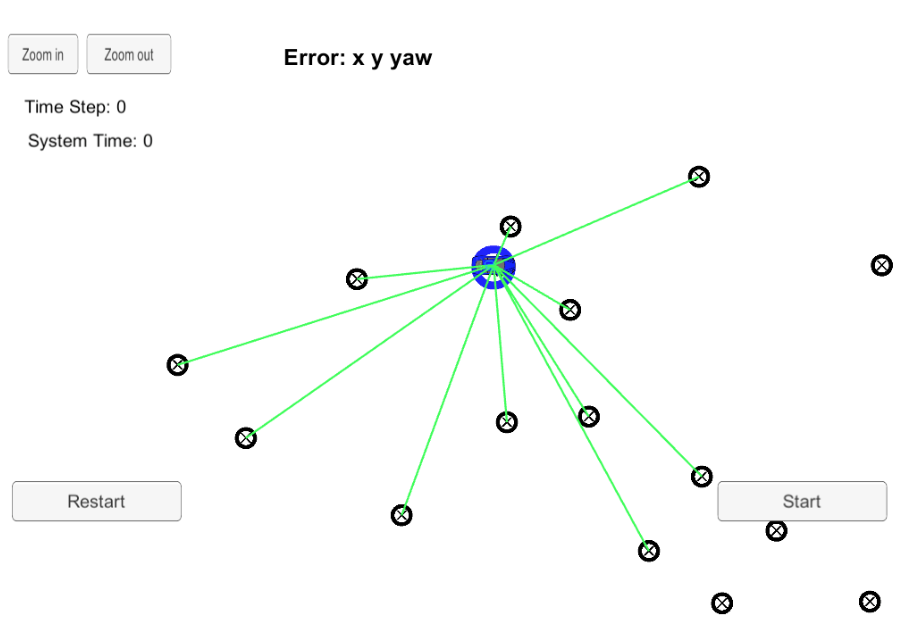

# Self-Driving Car Engineering

  

## Overview

This repo contains my entire work and source code committed for Udacity's Self-Driving Car Nano-Degree. 

## Projects

<table style="width:100%">
  <tr>
    <th>
      

           
            P1: Basic Lane Finding
           <!-- 
            <a href="./project_1_lane_finding_basic" name="p1_code">(code)</a> 
           -->
      

    </th>
        <th>

           
            P2: Traffic Signs Classifier
           <!-- 
            <a href="./project_2_traffic_sign_classifier" name="p2_code">(code)</a>
           -->
        

    </th>
       <th>

           
            P3: Behavioral Cloning
           <!-- 
            <a href="./project_3_behavioral_cloning" name="p3_code">(code)</a>
           -->
        

    </th>
        <th>

           
            P4: Adv. Lane Finding
           <!--
            <a href="./project_4_advanced_lane_finding" name="p4_code">(code)</a>
           -->
        

    </th>
  </tr>
  <tr>
    <th>

           
            P5: Vehicle Detection
           <!--
            <a href="./project_5_vehicle_detection" name="p5_code">(code)</a>
           -->
        

    </th>
        <th>

           
            P6: Extended Kalman Filter
        

    </th>
    <th>

           
            P7: Unscented Kalman Filter
        

    </th>
    <th>

           
            P8: Kidnapped Vehicle
        

    </th>
  </tr>
  <tr>
    <th>

           
            P9: PID Controller
        

    </th>
    <th>

           
            P10: MPC Controller
        

    </th>
   <th>

           
            P11: Path Planning
        

    </th>
    <th>

          
            P12: Semantic Segmentation
        

    </th>
  </tr>
</table>

### Capstone Project
- [**Traffic light classifier:**](https://github.com/ilopezfr/CarND-Capstone/tree/master/Traffic_Light_Detection)
- [**Systems Integration**](https://github.com/ilopezfr/CarND-Capstone/tree/master/Traffic_Light_Detection)

--- 
## Term 1

#### [P1 - Detecting Lane Lines](CarND-P1-Detecting-Lane-Lines)
- **Summary:** TODO
- Tags
 
#### [P2 - Traffic Sign Classification]()

 
#### [P3 - Behavioral Cloning]()

## Term 2

#### [P4 - Advanced Lane Finding]()

 
#### [P5 - Vehicle Detection]()

 
 #### [P6 - Extended Kalman Filter]()

 #### [P7 - Unscented Kalman Filter]()

## Term 3

#### [P8 - Kidnapped Vehicle]()

 
 #### [P9 - PID Control]()

 
#### [P10 - MPC Control]()

#### [P11 - Path Planning]()

#### [P12 - Road Semantic Segmentation]()

 
